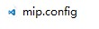
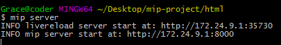

# 调试MIP网页

### 准备工作
先创建一个本地开发组件用的文件夹，存储位置自选，建议存储空间足够大，这时我们已经安装好了git，右键点击此文件夹弹出菜单 我们选择
，若右键菜单无此命令可以使用cd命令进入到目录中：

```
cd mip-project
```

### 初始化mip配置
我们在当前根目录下进行初始化mip 配置：  

```
$ mip init

```

此时会创建`mip.config`文件，  



### 新建一个MIP网页

```
$ mip add index.html
```

可以在新建网页的时候可以添加需要载入的mip组件，例如：

```
$ mip add index.html mip-img mip-video

```

将载入`mip-img`和`mip-video`两个组件，在这里继续gitbush here 输入以下命令

` mip server`  




