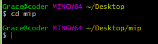
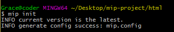
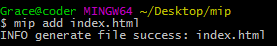
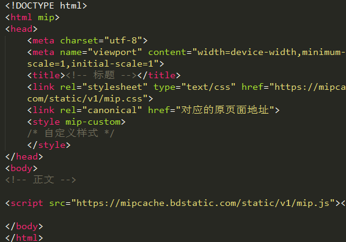

# 调试MIP网页

## 1.准备工作
先创建一个本地开发组件用的文件夹，存储位置自选，建议存储空间足够大，这时我们已经安装好了git，右键点击此文件夹弹出菜单 我们选择
，若右键菜单无此命令可以使用cd命令进入到目录中：

```
cd mip

```
  

## 2.初始化mip配置
我们在当前根目录下进行初始化mip 配置：  

```
$ mip init

```

  

此时会创建`mip.config`文件，  


## 3.新建一个MIP网页

在git中输入如下命令：
```
$ mip add index.html
```


成功添加后，本地文件夹中会出现index.html 文件

  

打开index.html 文件会发现，系统已经自动生成一个基础的MIP页面  



## 4.编写mip网页代码

在编写mip代码的时候需要注意符合mip网页规范，否则通不过mip校验程序，mip校验规则地址：

https://www.mipengine.org/doc/2-tech/2-validate-mip.html

## 5.校验MIP网页 

```
$ mip validate index.html
```

出现`ERROR`的条目通不过mip校验，需要进行修改。

例如：

  


**注意**： 
mip页面应该为`utf-8`编码，其他编码格式通不过校验，如果需要使用其他编码格式，可以使用线上校验器粘贴代码进行校验，  

线上校验器地址：
https://www.mipengine.org/validator/validate  


## 6.调试MIP网页

进入到mip项目目录，启动`mip server`，然后访问`http://127.0.01:8000`进入调试页面。

```
$ mip server
```

  

**注意**：

`mip server`默认监听`8000`和`35730`端口，如果有端口冲突可以在`mip.config`中修改启动端口。

也可以使用`mip server -f`命令强制关闭当前占用端口的node进程(windows下无效)。


