#### 使用mip-cli工具可以进行mip组件调试，包括2种方式：

1. 调试mip-extensions仓库中的组件
2. 调试本地编写的mip组件


## 调试mip-extensions仓库中的组件

#### 1.git clone最新的mip-extensions仓库到本地，然后启动`mip server`  

```
$ git clone https://github.com/mipengine/mip-extensions.git

```  
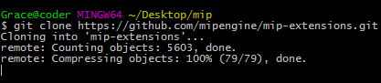   

``` 
$ cd mip-extensions  

```
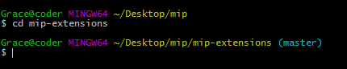    

```
$ mip server

```
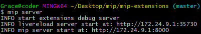  


#### 2.创建mip组件

在`mip-extensions`目录中创建组件：

```
$ mip addelement mip-demo  
```
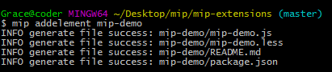  

在`mip-extensions`文件夹中创建了`mip-demo`组件，

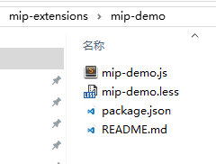  


可以开始编写mip-demo组件代码以及`README.md`文件。

**注意**
`README.md`文件中必须包含组件示例代码，`mip server`不会自动生成组件使用代码。

#### 3.打开调试网页`http://127.0.0.1:8000/`会列出当前仓库中的组件，点击进入`mip-demo`组件预览。 

访问`http://127.0.01:8000`进入调试页面。   

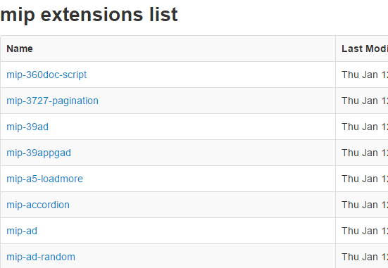       

进入`mip-demo`组件中进行开发，代码保存后，`mip server`会自动刷新预览页面。  


#### 4.组件提交到github仓库时需要进行校验，使用如下命令校验：

```
$ mip validateelement mip-demo
```

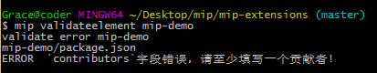

组件通过校验之后，提交到仓库.

#### 5.需要调试组件在mip网页中的引用情况，参考`调试项目中的mip组件`


## 调试项目中的mip组件

有时候在项目中创建了mip组件，想要和mip页面一起调试，可以设置`mip.config`来实现。

例如：项目结构如下`mip-demo`为mip组件，`mip-demo.html`为使用了`mip-demo`组件的页面。

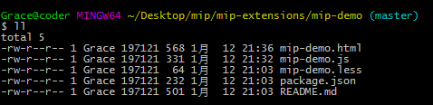  


mip-demo.html代码如下:

```html
<!DOCTYPE html>
<html mip>
<head>
    <meta charset="utf-8">
    <meta name="viewport" content="width=device-width,minimum-scale=1,initial-scale=1">
    <title><!-- 标题 --></title>
    <link rel="stylesheet" type="text/css" href="https://mipcache.bdstatic.com/static/v1/mip.css">
    <link rel="canonical" href="对应的原页面地址">
    <style mip-custom>
    /* 自定义样式 */
    </style>
</head>
<body>
<!-- 正文 -->
<mip-demo></mip-demo>
<script src="https://mipcache.bdstatic.com/static/v1/mip.js"></script>
<script src="https://mipcache.bdstatic.com/static/v1/mip-demo/mip-demo.js"></script>

</body>
</html>
```

**注意**

所有组件调试时引入方式都按照线上地址就可以，`mip server`会自动进行页面注入。


1.修改`mip.config`的字段`extensionsDir`为`./`，注意，是`./`不是`.`。

```javascript
    /**
     * 本地mip组件调试目录，主要用于开发组件时进行本地调试，会自动将本地mip组件注入到当前访问的页面中去
     *
     * @type {string}
     */
    extensionsDir: './',
```

2.启动mip server调试器，访问`mip-demo.html`页面可以看到，已经把项目中的`mip-demo`引入到页面了

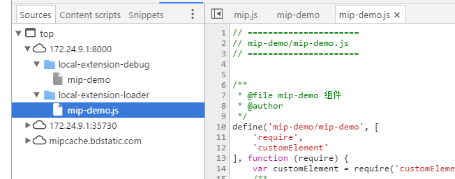


## 下面是一个示例   
  
### 开发一个自动弹出窗口的组件 `mip-alert` 

 
#### 1. 在`mip-extensions`目录中创建组件：  

```
$ mip addelement mip-alert    
  
```
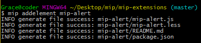    

在`mip-extensions`文件夹中创建了`mip-alert`组件，  

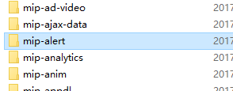    

#### 2. 在`mip-alert.js `文件中编写代码

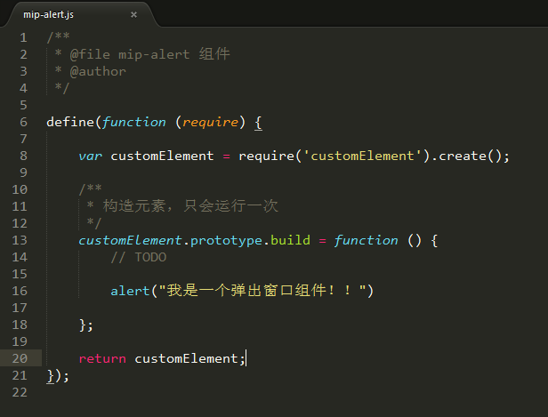       


可以开始编写`README.md`文件。  

### 3. 添加`mip-alert.html `文件并引入我们创建的`mip-alert `组件  

```

mip add mip-alert.html   


```
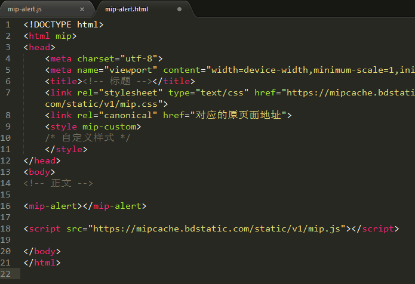  

#### 4. 修改根目录下`mip.config`文件的字段`extensionsDir`为`./`    

    

#### 5. 在`mip-extensions`目录下启动`mip server`    

       

访问`http://127.0.01:8000`进入调试页面。找到`mip-alert`组件，进入`mip-alert.html`页面，   
即能看到弹出窗口  

   

#### 6. 组件提交到github仓库时需要进行校验，使用如下命令校验：

```
$ mip validateelement mip-demo
```


组件通过校验之后，提交到仓库即可。  


至此通过校验后，我们的`mip-alert`组件已经开发完成。   


