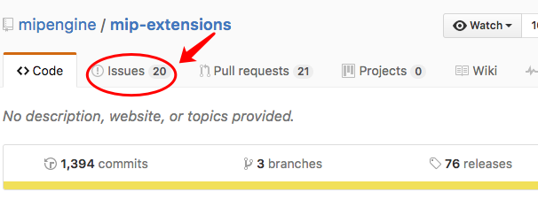
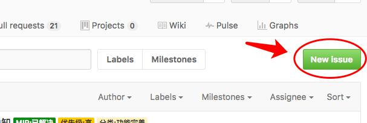
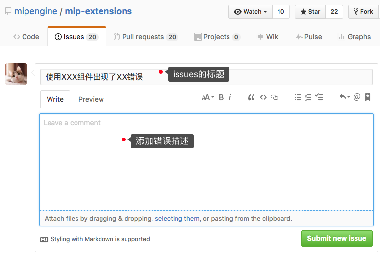

# issues的正确使用方式
issues是GitHub上为我们提供的追踪器，它有点类似于邮件，站长们可以通过向mip项目组提 issues的方式来解决相应的问题，如果代码层面有组件需求，或改进建议，可以通过issue与我们讨论，我们项目进展也会在issue中记录。
下面介绍issues的具体使用方式：

## 1.打开mip-extensions网址
issues的位置如箭头方向所指。   
[mip-extensions](https://github.com/mipengine/mip-extensions)    

 

## 2.打开并创建新的issues

   

## 3.输入issues的内容并提交

 
 提交之后可以在issues列表中查看您提出的issues，项目组会跟进您提出的问题。  
   
