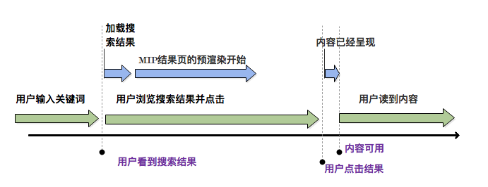

# 为什么MIP-cache存在 

百度MIP-Cache给所有符合规范的MIP页面提供cache服务，能够主动的提高页面加载速度，为使用 MIP-Cache 服务的页面上的图片、CSS文件等资源提供缓存服务，这样能做到所有HTTP请求来自于同源，能够加速加载速度。  
MIP-Cache 通过CDN(Content Delivery Network)服务器缓存静态MIP页面。当用户访问MIP页面时，请求首先会发到CDN服务器，如果页面存在，则从CDN直接返回静态页面；如果页面不存在，则会请求第三方服务器。返回的页面的同时加入MIP-Cache。
在使用MIP Cache时，MIP页面引用的所有静态文件和外部资源都会被替换成相对地址，缓存到CDN上。尽可能减少了DNS解析时间和网络请求时间。为减少网络传输耗时，MIP-JS 控制静态资源的按需加载，MIP-Cache系统优先从CDN读取文件。

## MIP Cache 能确保MIP页面的有效性
当第一次从MIP缓存请求MIP页面时，缓存首先会验证文档，并且如果它检测到问题，则不会将其提供给用户。我们可以选择将流量直接发送到原始的MIP页面或者发送到MIP缓存，但只有在从缓存提供服务时才能保证MIP页面有效性。它确保当用户看到MIP的闪电标志时，总是会获得快速和友好的体验。
## 允许MIP页面进行有效安全地预渲染  

如果说这篇文章最重要的内容，那就是预渲染，尤其是MIP中的多变，远远大于任何理论上你可以从来自一个源伺服器的主机上直接获取到的速度收益。即使这些将会浪费很多时间的源伺服器更靠近你的用户们，很少但还是有可能出现，预渲染将会很有可能造成更多的影响。
 #### 感觉上十分快
事实上，预渲染总是可以给你省几秒钟，而不是毫秒。预渲染的影响与其他MIP JS库中其他多种多样的性能优化相比，可以算得上是引人注目的，并且很大程度上有助于“即时感觉”的体验。
<!--图片-->
        
 #### 与完全预渲染相比效率非常高
我们确实可以轻松地从原始服务器预先渲染MIP页面。如果我们这样做，我们不能保证一个页面在原点是有效的MIP页面，并且有效的MIP页面对于惯进行预渲染是十分重要的，MIP JS库提供：MIP的预渲染，与仅仅通过类似预取的方式预渲染整个页面相比，也限制了用户的带宽，CPU和电池的使用。

有效的MIP页面在预渲染阶段期间进行“协作”行为：只有第一个视口中的资源被预加载，并且没有第三方脚本被执行。这导致用户更有可能去点击这种以更加便宜，更加少的带宽和占用更多CPU资源的方式的预加载，允许平台不仅去预渲染第一个视口，还有一些MIP页面的结果

#### 安全嵌入
因为MIP Cache不能依赖于浏览器的预渲染（请参阅上面的部分），从一个页面到另一个页面的正常导航不工作。因此，在MIP缓存模型中，需要在平台页面上内联地打开页面。MIP缓存确保请求的AMP页面可以安全地进行如下任务：

验证器确保主文档中没有跨站脚本（XSS）。
在验证器之上，AMP Cache 解析，然后以一个明确的方式重新序列化文档（这意味着它不依赖于HTML5错误纠正）。这确保浏览器解析错误和差异不能导致XSS。
高速缓存应用内容安全策略（CSP）。这提供了额外的防御XSS攻击。

#### 其他
此外，MIP缓存从预渲染中移除一个重要的潜在隐私问题：当您在内容平台上搜索在结果页面上预加载AMP页面时，预加载的MIP页面都不会知道他们已经被预加载。

举个例子：说我搜索“小苹果”。如果你知道的话，你知道我明显是搜索筷子兄弟的歌曲《小苹果》。但搜索结果页面还显示了几个MIP搜索结果从水果连锁店卖实际的苹果。在下个月，我不想看到实际的水果店的广告，即使我没有点击这些链接。广告商不会浪费RMB在有关于小苹果的网页上插入所有的上毫无意义的再营销广告。由于MIP隐藏了来自MIP页面和相关第三方的发布商的预载，因此对于用户和广告客户来说是一个双赢的局面。

## 自动优化通常导致速度显著增加

MIP缓存开始与上述所有，但是自从添加了一些转换变换（heh）到其功能名单。在这些优化中：

* 快速和免费的内容传送网络的所有内容。

* 通过将脚本引入理想顺序，删除重复的脚本标记和删除不必要的引号和空格等措施来优化HTML。
* 重写JavaScript url 以具有无限缓存时间。
* 优化图片（平均带宽提高40％！）

