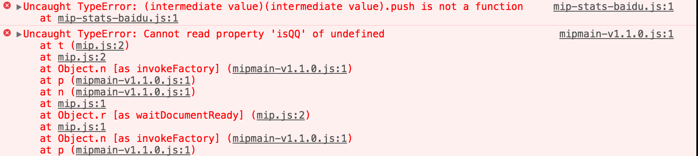

## 使用 MIP v1 稳定版本
在2016年末，MIP官方发布了v1新版本文件。v1版脚本不存在两位或三位的版本号，mip.js引用地址如下：

https://mipcache.bdstatic.com/static/v1/mip.js

这次升级旨在减少开发者对网页的维护成本：v1版本的代码内容由服务端统一控制。未来的功能升级，bugfix等代码改动会直接生效到v1文件中，站长无需再次修改版本。

## 老版本使用问题
线上存量一些非v1版本的问题，可能存在组合使用兼容性问题，功能问题等。我们希望仍然在使用老版本的开发者尽快迁移代码。
举例说明：
``` html
    <!-- 老版本css -->
    <link rel="stylesheet" type="text/css" href="https://mipcache.bdstatic.com/static/mipmain-v1.1.1.css">
    <!-- 老版本js -->
    <script src="https://mipcache.bdstatic.com/static/mipmain-v0.0.1.js" ></script>
    <script src="https://mipcache.bdstatic.com/static/v1.1/mip-stats-cnzz.js"></script>
```
从上可以看出，其中包含了`mipmain-v1.1.1.css`，`mipmain-v0.0.1.js`，`v1.1/mip-stats-cnzz.js`老版本的文件地址，其他的可以类推。

正如前文所述，新版本的都是 v1 版本，上面的对应的新版本如下所示：

``` html
    <!-- 老版本css -->
    <link rel="stylesheet" type="text/css" href="https://mipcache.bdstatic.com/static/v1/mip.css">
    <!-- 老版本js -->
    <script src="https://mipcache.bdstatic.com/static/v1/mip.js" ></script>
    <script src="https://mipcache.bdstatic.com/extensions/platform/v1/mip-cambrian/mip-cambrian.js"></script>
    <script src="https://mipcache.bdstatic.com/static/v1/mip-stats-cnzz/mip-stats-cnzz.js"></script>
```

### 老版本存在的问题

老版本是 MIP 团队早期的版本迭代的技术方案，由于该方案对应的版本号不定，会带来开发者需求频繁更新的困扰，所以，在16年11月 MIP 的统一版本 v1 诞生。

#### 1、 版本兼容问题
v1版本不对老版本进行兼容处理，所以这就意味着，如果页面使用 v1 版本的脚本，那该页面上的所有的 MIP 脚本和 css 的版本都需要是 v1 版本的，如果存在新老交杂的情况，页面展现可能没有问题，但页面功能，包括组件的功能、组件样式等可能存在问题。

下面举个栗子。

从一个 MIP 页面，看到他们的 MIP 的脚本引入如下图：


可以看到控制台 js 报错如下图：


从上面的 case 可以看出，如果要用老版本就全用老版本，如果用 v1 版本就全用 v1 版本。当然，作者在这呼吁，有长期维护稳定的 v1 版本，为什么要用老版本呢？所有的都升级到 v1 版本是最佳的 MIP 实践。

#### 2、 功能使用问题

what？我按照官网组件使用，添加到了页面，为什么这个组件的一些功能缺失？

OK，因为我们的功能迭代只针对 v1 版本，老版本的功能都是16年11月前开发实现的，在这个之后的功能，都是在老版本上缺失的。官网介绍的组件功能，当然也是针对 v1 版本的。可以从官网的所需脚本可以看出，如下图：


如果避免上述问题呢？

同理，我们都按照 v1 版本来添加页面的 MIP 文件即可。

### 老版本的处理方式

1、通过本文，呼吁开发者都是用稳定的最新的 v1 版本；

2、17年Q4，我们会升级校验模块，对这部分使用的问题，进行 warning 提示，让开发者便于发现和修改；

3、将老版本的文件添加到 MIP 校验中，通过规则使这部分页面 MIP 校验失败。

第3种处理办法，我们执行的节奏是：

1、老版本的页面流量非常小；

2、提前一个月发文进行预告通知。

OK，在本文最后，再次呼吁所有开发者，使用 MIP 的 [v1 版本](http://www.cnblogs.com/mipengine/p/6077510.html)的文件。
